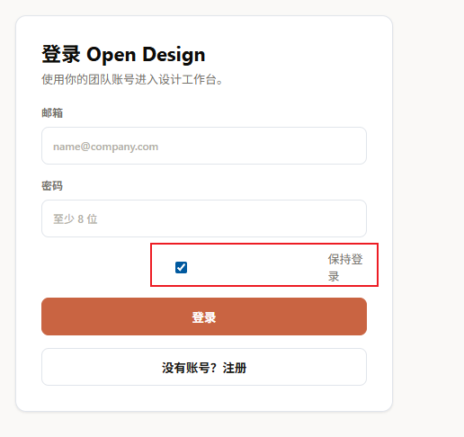

我想将这个系统改造成一个让团队成员一起使用的平台，具体要求如下
1. 按照当前网站的风格设计一个用户注册和登录的页面，团队每个人可以注册自己的账号
2. 每个账号只能看到自己的设计，管理员账号可以看到所有人的设计
3. 只有管理员账号有配置网站的权限，其他账号只能使用不能配置
请你按照以上要求，帮我写一份网站改造设计方案，写完之后保存到"系统改造"目录中，有什么问题直接和我沟通

我刚刚将本地仓库代码和远程仓库保持一致了，你看看方案有没有要修改的，没有的话，你按照这个方案改造一下

按照如下要求修改一下系统功能
1. admin用户登录之后可以管理其他用户
2. 登录注册页面保持登录样式修改一下